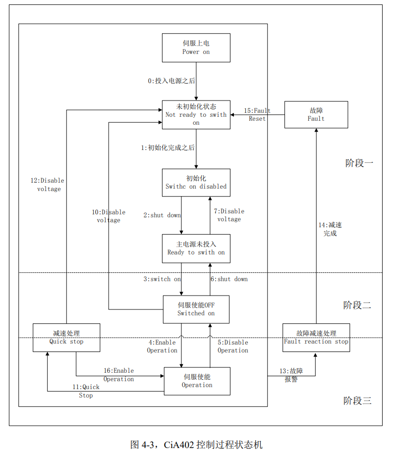
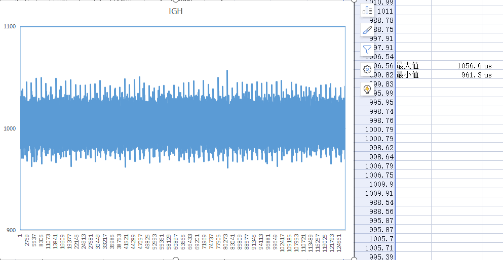

# IgH主站应用使用详解

## 环境

* 主站: Q1使用IgH搭建的EtherCAT主站
* 从站: X3E伺服控制器

## IgH主站应用流程

### 1. 请求一个主站实例

   ``` c
   /* 
    * master_index: 主站的索引，IgH支持同时存在多个主站 
    * return: 主站的实例
    */
   ec_master_t *ecrt_request_master(unsigned int master_index);
   /* 释放主站 */
   void ecrt_release_master(ec_master_t *master);
   ```

### 2. 为从站创建一个数据域(domain)

   主站需要为每个从站创建数据域，用于存放从站的过程数据和从站的其他依赖数据

   ``` c
   /*
    * master: 主站实例
    * return: 申请的数据域
    */
   ec_domain_t *ecrt_master_create_domain(ec_master_t *master);
   ```

### 3. 配置从站信息

   扫描主站: `ethercat rescan`

   查询当前总线上的所有主站: `ethercat slaves`

   ```shell
   0  0:0  PREOP  +  HCFA X3E Servo Driver
   ```

   当主站使用`ethercat rescan`扫描到从站后，可以使用`ethercat cstruct`查看从站相关信息

   ``` C
   /* X3E使用ethercat cstruct结果 */
   /* Master 0, Slave 0, "HCFA X3E Servo Driver"
    * Vendor ID:       0x000116c7
    * Product code:    0x003e0402
    * Revision number: 0x00000001
    */
   ec_pdo_entry_info_t slave_0_pdo_entries[] = {
       {0x6040, 0x00, 16}, /* Control Word */
       {0x6060, 0x00, 8}, /* Modes of operation  */
       {0x607a, 0x00, 32}, /* Target position */
       {0x60ff, 0x00, 32}, /* Target velocity */
       {0x6071, 0x00, 16}, /* Target torque  */
       {0x603f, 0x00, 16}, /* Error Code */
       {0x6041, 0x00, 16}, /* Status Word */
       {0x6061, 0x00, 8}, /* Modes of operation display  */
       {0x6064, 0x00, 32}, /* Position actual value */
       {0x606c, 0x00, 32}, /* Velocity actual value  */
       {0x6077, 0x00, 16}, /* Torque actual value  */
       {0x213f, 0x00, 16}, /* Servo Error Code */
   };
   
   ec_pdo_info_t slave_0_pdos[] = {
       {0x1600, 5, slave_0_pdo_entries + 0}, /* 1st RxPDO-Mapping */
       {0x1a00, 7, slave_0_pdo_entries + 5}, /* 1st TxPDO-Mapping */
   };
   
   ec_sync_info_t slave_0_syncs[] = {
       {0, EC_DIR_OUTPUT, 0, NULL, EC_WD_DISABLE},
       {1, EC_DIR_INPUT, 0, NULL, EC_WD_DISABLE},
       {2, EC_DIR_OUTPUT, 1, slave_0_pdos + 0, EC_WD_ENABLE},
       {3, EC_DIR_INPUT, 1, slave_0_pdos + 1, EC_WD_DISABLE},
       {0xff}
   };
   ```

   1. 根据从站的位置设置从站的产品信息(厂商ID和产品代码)

      ``` c
      /*
       * master: 主站实例
       * alias/position: 主站位置。
       *				   当alias为0，使用position作为位置；当alias不为0，alias为位置，position为位置偏移
       * vendor_id: 厂商ID
       * product_code: 产品代码
       * return: 从站的配置信息
       */
      ec_slave_config_t *ecrt_master_slave_config(ec_master_t *master, uint16_t alias, uint16_t position, uint32_t vendor_id, uint32_t product_code);
      ```
   
   2. 为每个从站配置同步数据

      ``` c
      /*
       * sc: 从站的配置信息
       * n_syncs: 同步数据的数量
       * syncs: 同步数据数组
       * return: 0: 成功；非0失败
       */
      int ecrt_slave_config_pdos(ec_slave_config_t *sc, unsigned int n_syncs, const ec_sync_info_t syncs[]);
      ```
   
   3. 把每个从站的同步寄存器数据映射到应用程序空间，可以通过读写应用程序中的变量来实现读取和改变从站的数据和状态

      ``` c
      /*
       * domain: 从站数据域
       * pdo_entry_reg: 具体的映射方法和映射位置
       * return: 0: 成功；非0失败
       */
      int ecrt_demain_reg_pdo_entry_list(ec_domain_t *domain, const ec_pdo_entry_reg_t *pdo_entry_regs);
      ```

### 4. 配置同步时钟

   ``` c
   /*
    * sc: 从站配置信息
    * assign_activate: 厂商特殊激活指令
    * sync_cycle/sync_shift: 时钟周期，sync1_shift会被忽略
    */
   void ecrt_slave_config_dc(ec_slave_config_t *sc, uint16_t assign_activate, uint32_t sync0_cycle, int32_t sync0_shift, uint32_t sync1_cycle, int32_t sync1_shift);
   
   /*
    * master: 主站实例
    * app_time: 应用程序时间(主站操作带分布时钟的从站时，必须知道应用程序时间)
    * 该函数需要周期执行，主站不会自动的设置
    */
   void ecrt_master_application_time(ec_master_t *master, uint64_t app_time);
   
   /* 设置从站的同步时间 */
   void ecrt_master_sync_reference_clock(ec_master_t *master); // 使用应用程序时间
   void ecrt_master_sync_reference_clock_to(ec_master_t *master, uint64_t sync_time); // 使用sync_time
   /* 所有的从站将会同步设置的时间 */
   void ecrt_master_sync_slave_clocks(ec_master_t *master);
   ```

### 5. 激活主站

   以上的过程只是将数据存放在主站的每个从站的数据域中，并未配置到从站，激活主站后会激活主站的OP线程执行从站初始化状态机。

   主站激活后，发送和接受数据由周期任务来完成

   ``` c
   /*
    * master: 主站实例
    * return: 0: 成功；非0失败
    */
   int ecrt_master_activate(ec_master_t *master);
   /* 停止主站 */
   void ecrt_master_deactivate(ec_master_t *master);
   ```

### 6. 执行周期任务

   周期任务需要用户程序进行创建，IgH不提供相关方法。周期任务主要负责发送和接受数据，该任务的执行周期应该与从站的同步时钟周期保持一致

   ``` c
   /* 接收和处理数据域数据 */
   void ecrt_master_receive(ec_master_t *master);
   /* 确定数据域的数据状态 */
   void ecrt_domain_process(ec_domain_t *domain);
   /* 将数据域的数据存入数据域队列 */
   void ecrt_domain_queue(ec_domain_t *domain);
   /* 发送数据域队列中的所有数据 */
   void ecrt_master_send(ec_master_t *master);
   ```

## X3E的EtherCAT配置方法

### 配置流程图



### 配置步骤

#### 1. 设置从机的模式，成功后从机会处于`switch on disable`状态

#### 2. 设置从机`shut down`， 成功后从机会处于`ready switch on`状态

#### 3. 设置从机`switch on`，成功后从机会处于`switch on`状态

#### 4. 设置从机`enable operation`，成功后从机会处于`operation`状态

#### 5. 当从机处于`operation`状态时，就可以进行其他操作

### 相关文档

[X3E用户手册](./doc/禾川X3E伺服驱动器CANopen-EtherCAT用户手册V1.2.pdf)

[CANopen420v020标准](./doc/CiA402v020.pdf)

## 测试

### 测试环境

1. 测试demo和IgH主站都跑在CPU1上

2. 使用eth0作为主站网口

3. IgH主站测试时候版本stable-1.5: 9ec0eb6295a424cb30d996325ae8cfd7de819682

4. IgH编译选项: 

   ```shell
   ./configure CC=${CC} CXX=${CXX}  \
   	--host=arm-linux-gnueabihf --with-linux-dir=${LINUX_DIR} \
   	--enable-8139too=no --enable-hrtimer=yes --enable-generic=yes \
   	--prefix=${ROOT_PATH}/output --with-systemdsystemunitdir=${ROOT_PATH}/output/lib/systemd/system
   ```

5. 抓包工具wireshark2.0.2-32bit，下载地址: <https://pan.baidu.com/s/1c3WqxXI>,提取码:h72n

### 数据文件

[excel文件](./doc/igh.xlsx)

[wireshark数据包](./doc/igh.pcapng)

### 测试数据图表



## 参考文档

### EtherCAT文档

<https://blog.csdn.net/lswdcyy/article/details/105453144>

<https://blog.csdn.net/pwl999/article/details/109397700>

<https://blog.51cto.com/u_13941677/2345470>

<https://zhuanlan.zhihu.com/p/376003196>

### 抓包测试文档

<https://blog.51cto.com/u_13941677/2372239>

<https://blog.csdn.net/stu_ding/article/details/70312989>

<https://blog.csdn.net/x356982611/article/details/71710102>

<https://www.wireshark.org/docs/dfref/#section_e>

## 参考源码

**NOTE:** *在使用时，最好关闭内核的日志输出到控制台，不然会影响调度，造成时间同步出错，电机会抖动*

关闭内核输出到控制台命令: `echo 1 4 1 7 > /proc/sys/kernel/printk`

``` C
#include <errno.h>
#include <signal.h>
#include <stdio.h>
#include <string.h>
#include <sys/resource.h>
#include <sys/time.h>
#include <sys/types.h>
#include <unistd.h>
#include <time.h> /* clock_gettime() */
#include <sys/mman.h> /* mlockall() */
#include <sched.h> /* sched_setscheduler() */

/****************************************************************************/

#include "ecrt.h"

/****************************************************************************/

/** Task period in ns. */
#define PERIOD_NS   (1000000)

#define MAX_SAFE_STACK (8 * 1024) /* The maximum stack size which is
                                     guranteed safe to access without
                                     faulting */

/****************************************************************************/

/* Constants */
#define NSEC_PER_SEC (1000000000)
#define FREQUENCY (NSEC_PER_SEC / PERIOD_NS)

/* Status world define */
#define STATUSWORLD_SWITCH_ON_DISABLE 		(0x0040)
#define STATUSWORLD_SWITCH_ON_DISABLE_MASK 	(0x004f)
#define STATUSWORLD_READY_SWITCH_ON		(0x0021)
#define STATUSWORLD_READY_SWITCH_ON_MASK 	(0x006f)
#define STATUSWORLD_SWITCH_ON			(0x0023)
#define STATUSWORLD_SWITCH_ON_MASK 		(0x006f)
#define STATUSWORLD_ENABLE_OPERATION		(0x0027)
#define STATUSWORLD_ENABLE_OPERATION_MASK 	(0x006f)
#define STATUSWORLD_FAULT			(0x0008)
#define STATUSWORLD_FAULT_MASK 			(0x004f)

/* Ctrl world define */
#define CTRLWORLD_SHUTDOWM 			(0x0006)
#define CTRLWORLD_SWITCH_ON 			(0x0007)
#define CTRLWORLD_ENABLE_OPERATION 		(0x000f)
#define CTRLWORLD_FAULT		 		(0x0080)

/****************************************************************************/

// EtherCAT
static ec_master_t *master = NULL;
static ec_master_state_t master_state = {};

static ec_domain_t *domain1 = NULL;
static ec_domain_state_t domain1_state = {};

static ec_slave_config_t *sc = NULL;
static ec_slave_config_state_t sc_state = {};

static unsigned int counter = 0;
/****************************************************************************/
enum {
    DRIVE_TYPE_HOME = 0x06,
    DRIVE_TYPE_CSP = 0x08,
    DRIVE_TYPE_CSV = 0x09,
    DRIVE_TYPE_CST = 0x0A,
};

struct slave_servo_t {
	unsigned int cur_servo_mode; //0x6061 
	unsigned int set_servo_mode; //0x6060 
	unsigned int statusWord;    //0x6041 
	unsigned int ctrlWord;      //0x6040 
	unsigned int cur_position;  //0x6064 
	unsigned int set_position;  //0x607A
	unsigned int cur_velocity;  //0x606C
	unsigned int set_velocity;  //0x60FF
	unsigned int cur_torque;    //0x6077
	unsigned int set_torque;    //0x6071
	unsigned int error_code;    //0x603f
	unsigned int servo_error;   //0x213f
	uint8_t servo_on:1;       //
	uint8_t error_clear:1;    //
	uint8_t go_home:1;
};

#define DemoX3EPos 	0, 0  //第一个从站 从0开始
#define DEMOX3INFO 	0x000116c7, 0x003e0402

#define SLAVE0_POS 	DemoX3EPos
#define SLAVE0_INFO  	DEMOX3INFO

#define TIMESPEC2NS(T) ((uint64_t) (T).tv_sec * NSEC_PER_SEC + (T).tv_nsec)

// process data
static uint8_t *domain1_pd = NULL;

// offsets for PDO entries
static struct slave_servo_t slave_servo[1];

const static ec_pdo_entry_reg_t domain1_regs[] = {
	{SLAVE0_POS, SLAVE0_INFO, 0x6040, 0, &slave_servo[0].ctrlWord},
	{SLAVE0_POS, SLAVE0_INFO, 0x6060, 0, &slave_servo[0].set_servo_mode},
	{SLAVE0_POS, SLAVE0_INFO, 0x607a, 0, &slave_servo[0].set_position},
	{SLAVE0_POS, SLAVE0_INFO, 0x60FF, 0, &slave_servo[0].set_velocity},
	{SLAVE0_POS, SLAVE0_INFO, 0x6071, 0, &slave_servo[0].set_torque},

	{SLAVE0_POS, SLAVE0_INFO, 0x603f, 0, &slave_servo[0].error_code},
	{SLAVE0_POS, SLAVE0_INFO, 0x6041, 0, &slave_servo[0].statusWord},
	{SLAVE0_POS, SLAVE0_INFO, 0x6061, 0, &slave_servo[0].cur_servo_mode},
	{SLAVE0_POS, SLAVE0_INFO, 0x6064, 0, &slave_servo[0].cur_position},
	{SLAVE0_POS, SLAVE0_INFO, 0x606c, 0, &slave_servo[0].cur_velocity},
	{SLAVE0_POS, SLAVE0_INFO, 0x6077, 0, &slave_servo[0].cur_torque},
	{SLAVE0_POS, SLAVE0_INFO, 0x213f, 0, &slave_servo[0].servo_error},
	{}
};

/*****************************************************************************/
/* Master 0, Slave 0, "HCFA X3E Servo Driver"
 * Vendor ID:       0x000116c7
 * Product code:    0x003e0402
 * Revision number: 0x00000001
 */
ec_pdo_entry_info_t slave_0_pdo_entries[] = {
	{0x6040, 0x00, 16}, /* Control Word */
	{0x6060, 0x00, 8}, /* Modes of operation  */
	{0x607a, 0x00, 32}, /* Target position */
	{0x60ff, 0x00, 32}, /*set_velocity*/
	{0x6071, 0x00, 16}, /* set_torque*/

	{0x603f, 0x00, 16}, /* Error Code */
	{0x6041, 0x00, 16}, /* Status Word */
	{0x6061, 0x00, 8}, /* Modes of operation display  */
	{0x6064, 0x00, 32}, /* Position actual value */
	{0x606c, 0x00, 32}, /* Position actual value */
	{0x6077, 0x00, 16}, /*cur_torque */
	{0x213f, 0x00, 16}, /* Servo Error Code */
};

ec_pdo_info_t slave_0_pdos[] = {
	{0x1600, 5, slave_0_pdo_entries + 0}, /* 1st RxPDO-Mapping */
	{0x1a00, 7, slave_0_pdo_entries + 5}, /* 1st TxPDO-Mapping */
};

ec_sync_info_t slave_0_syncs[] = {
	{0, EC_DIR_OUTPUT, 0, NULL, EC_WD_DISABLE},
	{1, EC_DIR_INPUT, 0, NULL, EC_WD_DISABLE},
	{2, EC_DIR_OUTPUT, 1, slave_0_pdos + 0, EC_WD_ENABLE},
	{3, EC_DIR_INPUT, 1, slave_0_pdos + 1, EC_WD_DISABLE},
	{0xff}
};

/*****************************************************************************/

void check_domain1_state(void)
{
	ec_domain_state_t ds;

	ecrt_domain_state(domain1, &ds);

	if (ds.working_counter != domain1_state.working_counter) {
		printf("Domain1: WC %u.\n", ds.working_counter);
	}
	if (ds.wc_state != domain1_state.wc_state) {
		printf("Domain1: State %u.\n", ds.wc_state);
	}

	domain1_state = ds;
}

/*****************************************************************************/

void check_master_state(void)
{
	ec_master_state_t ms;

	ecrt_master_state(master, &ms);

	if (ms.slaves_responding != master_state.slaves_responding) {
		printf("%u slave(s).\n", ms.slaves_responding);
	}
	if (ms.al_states != master_state.al_states) {
		printf("AL states: 0x%02X.\n", ms.al_states);
	}
	if (ms.link_up != master_state.link_up) {
		printf("Link is %s.\n", ms.link_up ? "up" : "down");
	}

	master_state = ms;
}

/*****************************************************************************/

void check_slave_config_states(void)
{
	ec_slave_config_state_t s;
	ecrt_slave_config_state(sc, &s);
	if (s.al_state != sc_state.al_state) {
		printf("slave: State 0x%02X.\n", s.al_state);
	}
	if (s.online != sc_state.online) {
		printf("slave: %s.\n", s.online ? "online" : "offline");
	}
	if (s.operational != sc_state.operational) {
		printf("slave: %soperational.\n", s.operational ? "" : "Not ");
	}

	sc_state = s;
}

/*****************************************************************************/

void cyclic_task()
{
	unsigned int status_world = 0, ctrl_world = 0;
	struct timespec time;
	clock_gettime(CLOCK_MONOTONIC, &time);
	ecrt_master_application_time(master, TIMESPEC2NS(time));

	// receive process data
	ecrt_master_receive(master);
	ecrt_domain_process(domain1);

	// check process data state
	check_domain1_state();
	if (counter) {
		counter--;
	} else { // do this at 1 Hz
		counter = FREQUENCY;

		// check for master state (optional)
		check_master_state();

		// check for slave configuration state(s) (optional)
		check_slave_config_states();
	}
	
	// write process data
	// set the X3E in the CSP mode
	EC_WRITE_U8(domain1_pd + slave_servo[0].set_servo_mode, DRIVE_TYPE_CSP);
	
	status_world = EC_READ_U8(domain1_pd+slave_servo[0].statusWord);
	ctrl_world = EC_READ_U16(domain1_pd+slave_servo[0].ctrlWord);
	// printf("Status word: 0x%02x, ctrlWorld: 0x%02x\n", status_world, ctrl_world);
	
	if (STATUSWORLD_SWITCH_ON_DISABLE == (status_world & STATUSWORLD_SWITCH_ON_DISABLE_MASK))
		// set to shut down
		if (CTRLWORLD_SHUTDOWM != ctrl_world) {
			EC_WRITE_U16(domain1_pd + slave_servo[0].ctrlWord, CTRLWORLD_SHUTDOWM);
			EC_WRITE_U32(domain1_pd + slave_servo[0].set_position, EC_READ_U32(domain1_pd + slave_servo[0].cur_position));
		}
	
	if (STATUSWORLD_READY_SWITCH_ON == (status_world & STATUSWORLD_READY_SWITCH_ON_MASK))
		// set to switch on
		if (CTRLWORLD_SWITCH_ON != ctrl_world) 
			EC_WRITE_U16(domain1_pd + slave_servo[0].ctrlWord, CTRLWORLD_SWITCH_ON);
			
	if (STATUSWORLD_SWITCH_ON == (status_world & STATUSWORLD_SWITCH_ON_MASK))
		// set to enable operation
		if (CTRLWORLD_ENABLE_OPERATION != ctrl_world)
			EC_WRITE_U16(domain1_pd + slave_servo[0].ctrlWord, CTRLWORLD_ENABLE_OPERATION);
	
	if (STATUSWORLD_ENABLE_OPERATION == (status_world & STATUSWORLD_ENABLE_OPERATION_MASK))
		EC_WRITE_U32(domain1_pd + slave_servo[0].set_position, EC_READ_U32(domain1_pd + slave_servo[0].cur_position) + 0x10000);
		
	if (STATUSWORLD_FAULT == (status_world & STATUSWORLD_FAULT_MASK))
		EC_WRITE_U16(domain1_pd + slave_servo[0].ctrlWord, CTRLWORLD_FAULT);

	ecrt_master_sync_reference_clock(master);
	ecrt_master_sync_slave_clocks(master);

	// send process data
	ecrt_domain_queue(domain1);
	ecrt_master_send(master);
}

/****************************************************************************/

void stack_prefault(void)
{
	unsigned char dummy[MAX_SAFE_STACK];

	memset(dummy, 0, MAX_SAFE_STACK);
}

/****************************************************************************/
static int is_running = 1;

static void sighandler(int sig)
{
	if (SIGINT == sig)
		is_running = 0;
}

int main(int argc, char **argv)
{
	struct timespec wakeup_time;
	int ret = 0;
	
	signal(SIGINT, sighandler);

	master = ecrt_request_master(0);
	if (!master) {
		fprintf(stderr, "request master failed\n");
		ret = -1;
		goto err_request_master;
	}

	domain1 = ecrt_master_create_domain(master);
	if (!domain1) {
		fprintf(stderr, "create domain failed\n");
		ret = -1;
		goto err_create_domain;
	}

	if (!(sc = ecrt_master_slave_config(master, SLAVE0_POS, SLAVE0_INFO))) {
		fprintf(stderr, "Failed to get slave configuration.\n");
		ret = -1;
		goto err_slave_config;
	}

	if (ecrt_slave_config_pdos(sc, EC_END, slave_0_syncs)) {
		fprintf(stderr, "Failed to configure PDOs.\n");
		ret = -1;
		goto err_config_pdos;
	}

	if (ecrt_domain_reg_pdo_entry_list(domain1, domain1_regs)) {
		fprintf(stderr, "PDO entry registration failed!\n");
		ret = -1;
		goto err_entry_list;
	}
	
	// configure SYNC signals for this slave
	printf("Config DC enable!\n");
	ecrt_slave_config_dc(sc, 0x0300, 1000000, 0, 0, 0); /* 1ms */

	printf("Activating master...\n");
	if (ecrt_master_activate(master)) {
		fprintf(stderr, "Master activate failed!\n");
		ret = -1;
		goto err_activate;
	}

	if (!(domain1_pd = ecrt_domain_data(domain1))) {
		fprintf(stderr, "Get domain data failed!\n");
		ret = -1;
		goto err_domain_data;
	}

	/* Set priority */
	struct sched_param param = {};
	param.sched_priority = sched_get_priority_max(SCHED_FIFO);

	printf("Using priority %i.", param.sched_priority);
	if (sched_setscheduler(0, SCHED_FIFO, &param) == -1)
		perror("sched_setscheduler failed");

	/* Lock memory */
	if (mlockall(MCL_CURRENT | MCL_FUTURE) == -1)
		fprintf(stderr, "Warning: Failed to lock memory: %s\n",
				strerror(errno));

	stack_prefault();

	printf("Starting RT task with dt=%u ns.\n", PERIOD_NS);

	clock_gettime(CLOCK_MONOTONIC, &wakeup_time);
	printf("time: %lds, %ldns\n", wakeup_time.tv_sec, wakeup_time.tv_nsec);
	wakeup_time.tv_sec += 1; /* start in future */
	wakeup_time.tv_nsec = 0;

	while (is_running) {
		ret = clock_nanosleep(CLOCK_MONOTONIC, TIMER_ABSTIME,
			&wakeup_time, NULL);
		if (ret) {
			fprintf(stderr, "clock_nanosleep(): %s\n", strerror(ret));
			break;
		}
		
		cyclic_task();

		wakeup_time.tv_nsec += PERIOD_NS;
		while (wakeup_time.tv_nsec >= NSEC_PER_SEC) {
			wakeup_time.tv_nsec -= NSEC_PER_SEC;
		    wakeup_time.tv_sec++;
		}
	}

err_domain_data:
	ecrt_master_deactivate(master);
err_activate:
err_entry_list:
err_config_pdos:
err_slave_config:
err_create_domain:
	ecrt_release_master(master);
err_request_master:
	return ret;
}
/****************************************************************************/
```

